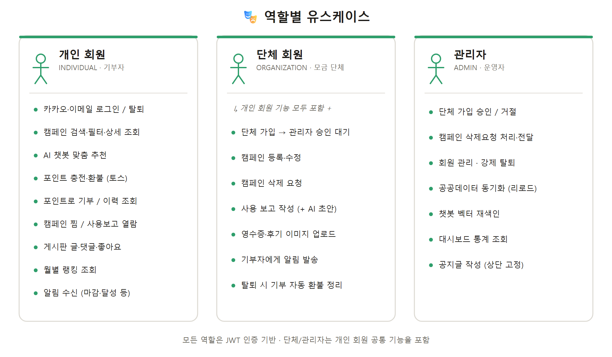
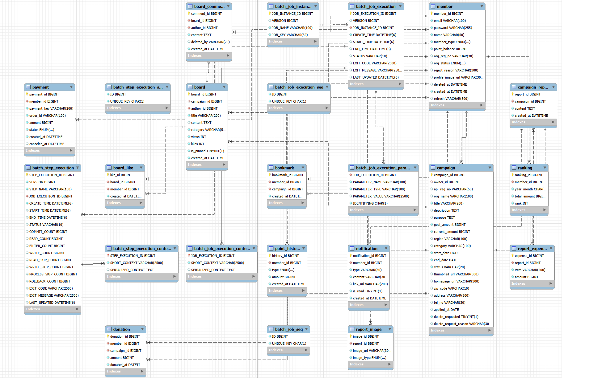
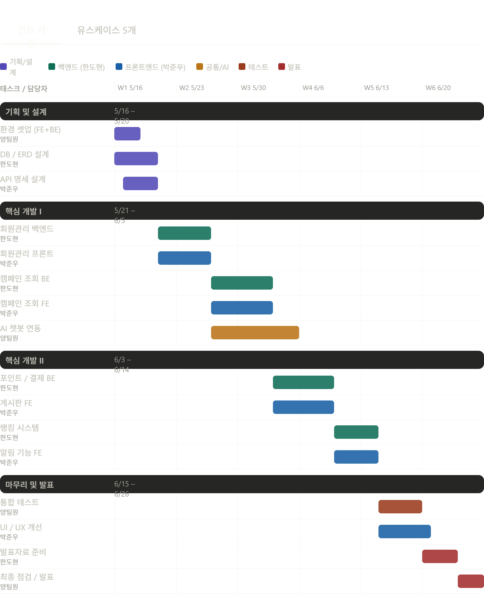
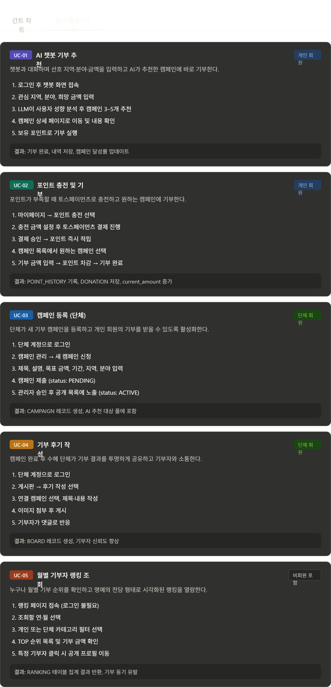
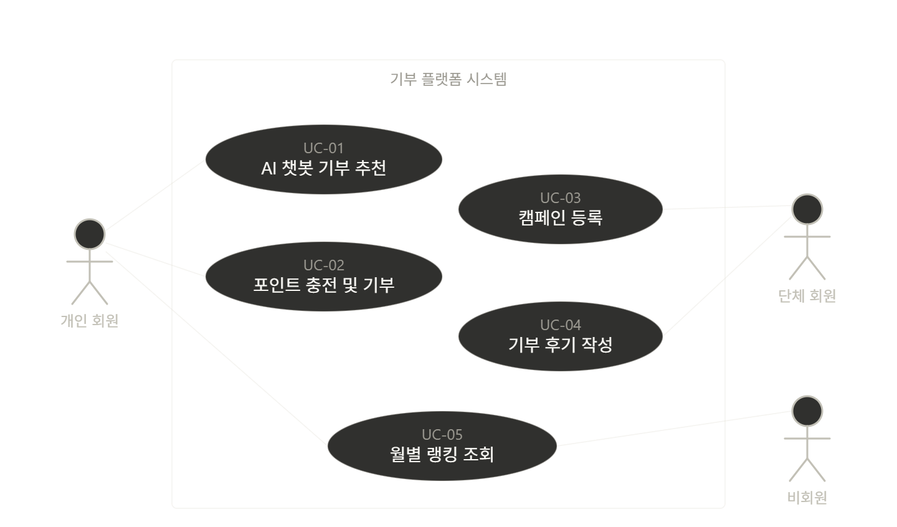

# 🤝 프로젝트명 : 도우미

> AI 챗봇이 당신에게 딱 맞는 기부처를 추천해드립니다.

<br>

## 📌 프로젝트 개요

공공데이터(행정안전부 기부관련단체정보서비스)와 단체가 직접 등록한 캠페인을 기반으로, **AI 챗봇(RAG)** 을 통해 사용자의 관심 지역·분야에 맞는 기부 캠페인을 추천하고 **포인트 방식**으로 기부할 수 있는 웹 플랫폼입니다. 기부에 그치지 않고 단체의 **기부금 사용 보고**까지 공개해 투명성을 확보합니다.

<br>

## 👥 팀원 구성

| 이름 | 역할 |
|------|------|
| 한도현 | 팀장 |
| 박준우 | 팀원 |

<br>

## 🗓️ 개발 기간

- 전체 개발 기간 : 2026-05-15 ~ 2026-06-26

<br>

## ⚙️ 기술 스택

### Frontend


### Backend


### Database


### External Service


### DevOps & Deploy


<br>

## 🗂️ 프로젝트 구조

```
donation-project/
├── docker-compose.yml              # 배포: MySQL+Redis+백엔드+Nginx 정의
├── deploy.sh / server-setup.sh     # 배포·서버세팅 스크립트
├── DEPLOY.md                       # 배포 가이드
│
├── frontend/                       # Vue 3 프론트엔드
│   ├── Dockerfile / nginx.conf     # 정적 빌드 + 리버스 프록시
│   └── src/
│       ├── assets/
│       ├── components/             # 공통/도메인 컴포넌트 (admin/ 포함)
│       ├── lib/                    # api(axios), toss, kakao 등 유틸
│       ├── pages/                  # 라우트 단위 화면
│       ├── router/                 # Vue Router
│       ├── stores/                 # Pinia 상태 관리
│       └── styles/                 # 전역 스타일 / 테마(theme.css)
│
└── backend/                        # Spring Boot 백엔드 (도메인 기반 패키지)
    │                               #  + Dockerfile
    ├── sql/
    │   ├── donation.sql            # 전체 스키마(DDL) 초기화 스크립트
    │   └── sample_donations.sql    # 대시보드 그래프용 샘플 데이터
    └── src/main/
        ├── java/com/doumi/donation/
        │   ├── member/             # 회원·인증·단체 승인 (oauth/ 카카오 로그인 포함)
        │   ├── campaigns/          # 캠페인 CRUD + 상태 자동 전환(batch)
        │   ├── point/              # 포인트 충전/사용/이력
        │   ├── payment/            # 토스페이먼츠 결제·환불
        │   ├── board/              # 게시판·댓글·좋아요
        │   ├── report/             # 기부금 사용 보고
        │   ├── ranking/            # 월별 랭킹 집계(batch)
        │   ├── notification/       # 알림(batch)
        │   ├── bookmark/           # 찜(관심 캠페인)
        │   ├── stats/              # 통계(관리자 대시보드)
        │   ├── chatbot/            # AI 챗봇 + Redis 벡터 색인(RAG)
        │   ├── publicdata/         # 공공데이터 수집(batch)
        │   ├── file/               # 파일 업로드
        │   ├── config/             # Security / JWT 설정
        │   └── exception/          # 전역 예외 처리
        └── resources/
            ├── mapper/             # MyBatis Mapper XML
            └── application.properties
```

<br>

## 🖥️ 주요 기능

### 1. AI 챗봇 기부 추천 (RAG)
- 캠페인 데이터를 임베딩해 **Redis Vector Store** 에 색인하고, LLM이 의미 기반 유사도로 추천
- 사용자의 관심 지역·분야·목적에 맞는 캠페인을 대화로 안내
- 캠페인 등록/삭제·상태 변경 시 벡터 색인을 자동 동기화

### 2. 기부 캠페인
- 공공데이터 수집분 + 단체 직접 등록분 통합 조회 (지역·분야·상태 필터)
- 단체의 캠페인 등록/수정/삭제 요청, 관리자 승인·전달 처리
- 모금 진행률 시각화, **마감일·시작일에 따른 상태 자동 전환**(모집예정 → 모집중 → 모집완료, Spring Batch 스케줄러)

### 3. 회원 관리 / 인증
- 개인 / 단체 / 관리자 구분, **JWT 기반 인증**(Access + Refresh)
- **카카오 OAuth 간편 로그인** (인가코드 → 백엔드 토큰교환 → 회원 자동 가입)
- 단체 회원 가입 승인 워크플로 (PENDING → APPROVED / REJECTED)
- 회원 탈퇴는 기록 보존을 위한 **soft delete**, 프로필 이미지 등록

### 4. 포인트 결제 시스템
- 토스페이먼츠로 포인트 충전 및 **충전 취소(환불)**
- 충전 포인트로 캠페인 기부, 포인트 충전/사용/환불 이력 조회

### 5. 게시판
- 게시글 작성·수정·삭제, 댓글, 좋아요
- 관리자 공지(상단 고정), 댓글 **soft delete**(삭제 주체 기록)

### 6. 월별 기부자 랭킹
- 매달 기부 금액 기준 랭킹 집계(Spring Batch), 명예의 전당 형태로 시각화

### 7. 기부금 사용 보고 (+ AI 초안)
- 단체가 지출 항목 + 영수증/후기 이미지를 등록 → 캠페인 '사용완료' 전환
- **AI 초안 생성**: 영수증/사진/메모를 멀티모달 LLM(Gemini)에 보내 보고 본문·지출 내역 자동 정리
- 기부자에게 투명한 사용 결과 공개

### 8. 알림 / 찜
- 마감 임박·목표 달성·단체 승인 등 알림(읽음 처리/삭제)
- 관심 캠페인 찜하기

### 9. 🛠️ 관리자 대시보드
- 최근 6개월 기부 통계, 단체 승인, 캠페인 삭제 요청 처리, 챗봇 재색인
- **공공데이터 동기화(전체 리로드)**: 기존 캠페인·기부내역을 비우고 API에서 다시 수집 (Spring Batch 2단계: 삭제 → 수집)

<br>

## 🎭 유스케이스 (역할별)



### 👤 개인 회원 (INDIVIDUAL)
- 이메일 회원가입 / **카카오 간편 로그인**, 정보 수정·탈퇴, 프로필 이미지 등록
- 캠페인 목록·상세 조회, 지역·분야·상태 **검색/필터**
- **AI 챗봇**으로 관심사 기반 맞춤 캠페인 추천받기
- **포인트 충전**(토스페이먼츠) 및 충전 취소(환불)
- 포인트로 **기부**, 기부 내역·포인트 이력 조회
- 관심 캠페인 **찜(북마크)**
- 기부금 **사용 보고 열람** (지출 내역·영수증)
- 게시판 글·댓글·좋아요
- **월별 기부자 랭킹** 조회
- 마감 임박·목표 달성·사용 보고 등 **알림 수신**

### 🏢 단체 회원 (ORGANIZATION)
> 개인 회원의 모든 기능 + 단체 전용 기능

- 단체 회원가입(고유번호) → **관리자 승인 대기** (승인/거절 알림 수신)
- 승인 후 **캠페인 등록·수정**, '나의 캠페인' 관리
- **캠페인 삭제 요청** (관리자 승인 시 삭제)
- **기부금 사용 보고 작성** — 영수증/후기 이미지 업로드 + **AI 초안 생성**(Gemini)
- 보고 등록 시 캠페인 '사용완료' 전환, 기부자에게 알림 발송
- 탈퇴 시 소유 캠페인 자동 정리(미사용 캠페인 기부자에게 **포인트 환불 + 알림**)

### 🛠️ 관리자 (ADMIN)
- **단체 가입 승인/거절** (거절 사유 전달)
- **캠페인 삭제 요청 승인/거부**, 캠페인 전달 처리
- **회원 관리** — 목록 조회, 강제 탈퇴, 개별 알림 발송
- **공공데이터 동기화**(전체 리로드) 실행
- **챗봇 벡터 재색인** 실행
- **대시보드 통계** 조회 (최근 6개월 기부 등)
- **공지글 작성**(게시판 상단 고정)

<br>

## 데이터베이스 설계 (ERD)

전체 DDL은 [`backend/sql/donation.sql`](backend/sql/donation.sql) 참고.

주요 테이블: `MEMBER`, `CAMPAIGN`, `DONATION`, `POINT_HISTORY`, `PAYMENT`, `BOARD`, `BOARD_COMMENT`, `BOARD_LIKE`, `RANKING`, `BOOKMARK`, `NOTIFICATION`, `CAMPAIGN_REPORT`, `REPORT_EXPENSE`, `REPORT_IMAGE`



<br>

## 외부 API 연동

| API | 용도 |
|-----|------|
| 행정안전부 기부관련단체정보서비스 | 기부 캠페인 공공데이터 수집 |
| 토스페이먼츠 (샌드박스) | 포인트 충전·환불 결제 |
| 카카오 로그인 (OAuth) | 소셜 간편 로그인 |
| LLM API (OpenAI 호환) | 챗봇 추천 + 임베딩(RAG) |
| Gemini API | 사용 보고 AI 초안 생성(멀티모달) |

<br>

## 시작하기

### 사전 요구사항
- Java 21+
- MySQL 8.0+
- Redis (챗봇 벡터 스토어) — `redis/redis-stack` 권장
- Node.js (프론트엔드)

### 1) 데이터베이스 준비

```bash
# backend/sql/donation.sql 실행 → 스키마 생성 (DB를 drop 후 재생성하므로 초기화용)
mysql -u root -p < backend/sql/donation.sql
```

### 2) Redis 실행 (챗봇용)

```bash
docker run -d --name redis -p 6379:6379 redis/redis-stack:latest
```

### 3) 백엔드 실행

```bash
cd backend
# src/main/resources/application.properties 에 DB 접속 정보, API 키 입력 후
./gradlew bootRun
```

> ⚠️ DB를 새로 만들었다면(`donation.sql` 재실행) 백엔드를 **재시작**해야 Spring Batch 메타 테이블이 자동 생성됩니다.

### 4) 프론트엔드 실행

```bash
cd frontend
npm install
npm run dev
```

### 환경 변수 설정 (`application.properties`)

`application.properties.example`을 복사해 `application.properties`를 만들고 값을 채웁니다. (실제 키 파일은 git에 올라가지 않음)

```properties
# Database
spring.datasource.url=jdbc:mysql://localhost:3306/donation?serverTimezone=UTC&useUnicode=true&characterEncoding=utf8
spring.datasource.username=your_username
spring.datasource.password=your_password

# 공공데이터 API
public.api.key=your_service_key

# JWT
jwt.secret=your_jwt_secret_at_least_32_chars

# 토스페이먼츠 (샌드박스) — frontend/src/lib/toss.js 의 클라이언트 키와 같은 쌍이어야 함
toss.secret-key=test_gsk_...

# LLM / 임베딩 (OpenAI 호환 엔드포인트)
spring.ai.openai.base-url=https://...
spring.ai.openai.api-key=your_api_key

# Gemini (사용 보고 AI 초안)
gemini.base-url=https://generativelanguage.googleapis.com
gemini.api-key=your_gemini_api_key
gemini.model=gemini-3.5-flash

# 카카오 OAuth (REST API 키)
kakao.rest-api-key=your_kakao_rest_api_key

# 챗봇 Redis Vector Store
chatbot.redis.host=localhost
chatbot.redis.port=6379

# 파일 업로드 경로
app.upload.dir=C:/donation/uploads
```

> 카카오 로그인을 쓰려면 [developers.kakao.com](https://developers.kakao.com)에서 앱을 만들고 **Redirect URI**(`http://localhost:5173/oauth/kakao/callback`)를 등록해야 합니다.

<br>

## API 명세 (주요 엔드포인트)

| Method | URL | 설명 |
|--------|-----|------|
| POST | `/api/members` | 회원가입 |
| POST | `/api/v1/auth/login` | 로그인 (JWT 발급) |
| POST | `/api/v1/auth/kakao` | 카카오 로그인 (인가코드 → JWT) |
| POST | `/api/v1/auth/refresh` | Access 토큰 재발급 |
| GET | `/api/campaigns` | 캠페인 목록 조회 |
| GET | `/api/campaigns/{id}` | 캠페인 상세 조회 |
| POST | `/api/campaigns` | 캠페인 등록 (단체) |
| POST | `/api/points/charge` | 포인트 충전 |
| POST | `/api/points/use` | 포인트로 기부 |
| POST | `/api/payments/confirm` | 결제 승인 |
| POST | `/api/payments/{id}/cancel` | 결제 취소(환불) |
| GET | `/api/board` | 게시판 목록 |
| POST | `/api/board` | 게시글 작성 |
| POST | `/api/board/{id}/like` | 게시글 좋아요 |
| GET | `/api/rankings` | 월별 랭킹 조회 |
| GET/POST | `/api/campaigns/{id}/report` | 기부금 사용 보고 조회/등록 |
| POST | `/api/campaigns/{id}/report/draft` | 사용 보고 AI 초안 생성 |
| POST | `/api/files` | 이미지 업로드 |
| GET | `/api/notifications` | 알림 목록 |
| GET/POST/DELETE | `/api/bookmarks` | 찜 조회/추가/삭제 |
| POST | `/api/chatbot/chat` | AI 챗봇 기부 추천 |
| POST | `/api/admin/public-data` | 공공데이터 동기화 (관리자) |
| POST | `/api/admin/chatbot/reindex` | 챗봇 벡터 재색인 (관리자) |

<br>

## 🚢 배포 (Docker + AWS EC2)

EC2(Ubuntu) 한 대에 **Docker Compose**로 `MySQL + Redis Stack + Spring Boot + Nginx(Vue)`를 올립니다. Nginx가 `/api`·`/uploads`를 백엔드로 프록시하고 나머지는 Vue SPA를 서빙합니다.

```bash
bash server-setup.sh     # 새 서버 최초 1회 (Docker·swap 설치)
cp .env.example .env     # 비밀값 입력 (DB_PW, LLM_API_KEY, KAKAO_REST_KEY 등)
bash deploy.sh           # 빌드·기동·DB초기화·헬스체크 (반복 실행 가능)
```

자세한 절차·트러블슈팅은 [`DEPLOY.md`](DEPLOY.md) 참고.

<br>

## 📎 산출물

<br>
<br>

